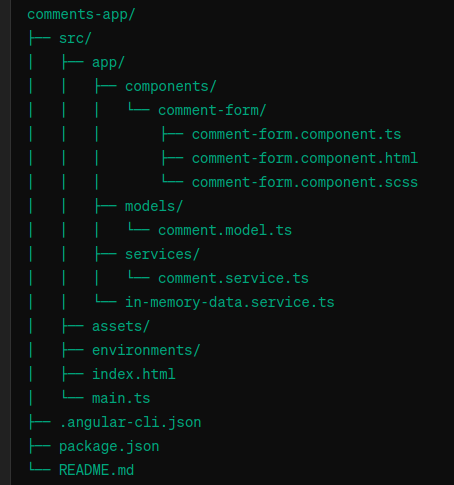

# Comments App

A Progressive Web App (PWA) built with Angular to collect user comments on specific topics. The application works both online and offline, saving comments locally when offline and syncing them when the connection is restored.

## Features

- **PWA Capabilities**: Works offline and can be added to the home screen on mobile devices.
- **Reactive Forms**: Uses Angular reactive forms for validation.
- **In-Memory Web API**: Simulates a backend for development purposes.
- **Dynamic Topics**: Users can select a topic and view comments related to that topic.

## Technologies Used

- Angular
- Angular Forms
- Angular Service Worker
- Angular In-Memory Web API

## Getting Started

### Prerequisites

- Node.js and npm installed on your machine.
- Angular CLI installed globally. If not, install it using:
  \`\`\`bash
  npm install -g @angular/cli
  \`\`\`

### Installation

1. Clone the repository:
   \`\`\`bash
   git clone https://github.com/bellash13/comments-app.git
   cd comments-app
   \`\`\`

2. Install dependencies:
   \`\`\`bash
   npm install
   \`\`\`

### Running the Application

1. Start the development server:
   \`\`\`bash
   ng serve
   \`\`\`

2. Open your browser and navigate to \`http://localhost:4200\`.

### Building for Production

1. Build the application for production:
   \`\`\`bash
   ng build --configuration production
   \`\`\`

2. The production-ready files are in the \`dist/\` directory.

### PWA Features

1. To test PWA capabilities, build the application and serve it using a static server like \`http-server\`:
   \`\`\`bash
   npm install -g http-server
   http-server ./dist/comments-app
   \`\`\`

2. Open your browser and navigate to the displayed local server address.

## Project Structure

\`\`\`

\`\`\`

## Usage

- Select a topic from the dropdown menu.
- Enter a comment in the text area.
- Click "Save" to submit the comment.
- View the comments for the selected topic on the right side of the form.
- If offline, the comments will be saved locally and synced when back online.

## Contributing

1. Fork the repository.
2. Create a new branch: \`git checkout -b feature-name\`.
3. Make your changes and commit them: \`git commit -m 'Add some feature'\`.
4. Push to the branch: \`git push origin feature-name\`.
5. Submit a pull request.

## License

This project is licensed under the MIT License - see the [LICENSE](LICENSE) file for details.
